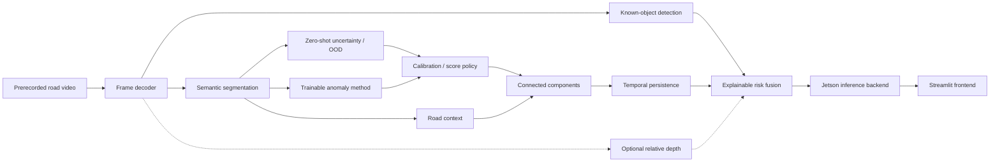

# System Architecture

## Status boundary

This document defines the approved target architecture. Only the existing PIDNet-S
single-image/Cityscapes path, four uncertainty scores, semantic metrics, Fishyscapes
adapter foundation, and AP/FPR95 metrics are implemented. Detection, training,
calibration, trainable OOD, context, temporal, depth, fusion, deployment, and UI
components remain planned.

## Target data flow



Recorded input is mandatory for the thesis demonstration. No component controls a
vehicle, and the dashboard is not a safety interface.

## Component responsibilities

| Component | Responsibility | Required evidence before promotion |
| --- | --- | --- |
| Frame decoder | Deterministic frame IDs, timestamps, RGB conversion, sequence reset | Codec/input provenance and decode timing |
| Semantic segmentation | Per-pixel closed-set road-scene logits and mask | Common training/evaluation plus export evidence |
| Known-object detection | Boxes, known class IDs, confidence, optional future track ID | Common ontology, detector metrics, export evidence |
| Zero-shot OOD | MSP, predictive entropy, MaxLogit, Energy from the selected logits grid | Direction, finiteness, AP/FPR95 development results |
| Trainable anomaly | Exportable learned anomaly signal trained on project synthetic data | Frozen feature/loss decision and semantic-retention evidence |
| Calibration | Semantic confidence calibration and separately governed OOD policy | Calibration-only split and before/after report |
| Road context | Drivable/near-road evidence derived from semantic output | Context ablation without holdout leakage |
| Components | Region extraction and interpretable region properties | Deterministic geometry and parameter ablations |
| Temporal persistence | State across frames and sequence-boundary reset | Event metrics, reset tests, lightweight cost |
| Relative depth | Optional near/medium/far evidence | Bounded feasibility and accepted Jetson cost |
| Risk fusion | Deterministic, inspectable signal combination | Per-signal contributions and controlled ablations |
| Jetson backend | Decode/inference/postprocess/telemetry service | Numerical equivalence and sustained benchmark |
| Streamlit | Prerecorded-stream presentation and results browser | Verified-backend whitelist and separate UI timing |

## Model output contracts

Contracts are versioned and path-free. Planned components must conform before they
can join the integrated pipeline.

| Output | Minimum contract |
| --- | --- |
| Raw frame | `HWC uint8 RGB`, positive dimensions, stable `frame_id` and sequence identity |
| Model input | `NCHW float32`, finite, recorded resize/normalization |
| `native_logits` | Direct semantic head output before softmax/resize, `NCHW float32`, finite |
| `aligned_logits` | Bilinear derivative of `native_logits` on the declared analysis grid, `NCHW float32`, finite; never called direct model output |
| Semantic mask | `NHW` integer train IDs on declared logits grid; ignore policy explicit |
| Detector result | Per-frame ordered records with `xyxy` float coordinates, canonical `class_id`, finite confidence, backend/model identity |
| Anomaly map | `NHW float32`, finite, higher means more anomalous, `logits_kind` and method identity recorded |
| Trainable anomaly output | `NHW float32` plus feature-tap/loss/checkpoint identity; same direction convention |
| Context/component result | Frame-relative region IDs, geometry, area, road overlap, score summaries, and parameter identity |
| Relative depth | Finite relative-depth/proximity evidence with method and scale boundary; not metric distance by default |
| Temporal event | Sequence-scoped event ID, frame interval, persistence evidence, state-reset provenance |
| Risk result | Operational label plus explicit semantic, detection, OOD, context, temporal, and optional depth contributions |

Batch and spatial relationships are validated at boundaries. Output grids used for
mask, scores, calibration, and metrics are recorded explicitly.

## Training-to-inference checkpoint handoff

```text
training framework checkpoint
→ immutable source/config/data/run identities
→ model-specific conversion adapter
→ EdgeGuard input/native-logit contract test
→ early or final ONNX export
→ shared alignment/scoring/evaluation
→ Jetson-built TensorRT engine and engine manifest
```

The training framework may differ from the deployment package, but conversion is
never an unrecorded manual step. A handoff report contains:

- training experiment ID, clean Git commit, resolved config, data-manifest hash,
  initialization source, class ontology, and checkpoint SHA-256;
- exact checkpoint-to-inference key mapping and missing/unexpected-key report;
- preprocessing, output tensor names, native/aligned shapes, dtype, precision, and
  sample equivalence measurements;
- exporter/opset/runtime identity and failed operators;
- promoted artifact identity and human approval state.

Silent partial loading, undocumented label remapping, or treating converted output as
the direct training-model output invalidates promotion.

## Deployment profiles

- **Profile A — Core:** selected semantic + four-score or selected OOD method + road
  context + lightweight temporal.
- **Profile B — Integrated:** Profile A + selected known-object detector.
- **Profile C — Aggressive:** Profile B + depth only if feasibility and device cost are
  accepted.

Complete A/B/C comparison is aggressive. The core deliverable requires one selected,
verified pipeline. A component that fails export can remain a scientific results card
but cannot be live-switched.

## Runtime, telemetry, and UI separation

Benchmark evidence records at least:

- decode/preprocess, semantic, detection, OOD, context/component, temporal/fusion,
  and end-to-end latency;
- warm-up policy, sample/frame count, batch, precision, input resolution, backend,
  synchronization method, and percentile statistics;
- CPU/GPU memory, power mode, power/energy when reliable, temperature, throttling,
  and sustained duration.

Streamlit receives structured results from the backend. Rendering, overlay creation,
video encoding, browser transport, and UI refresh timing are reported separately.
Streamlit FPS is never used as Jetson model or pipeline FPS.
